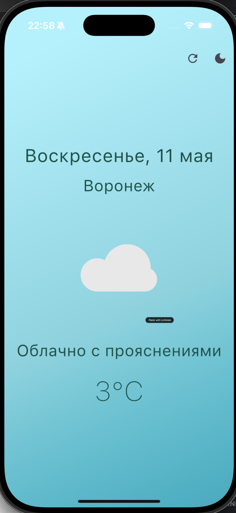
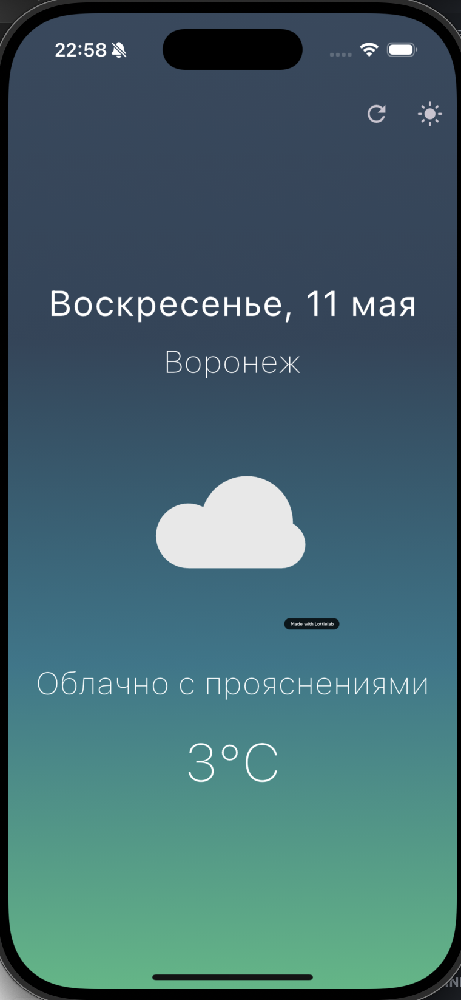
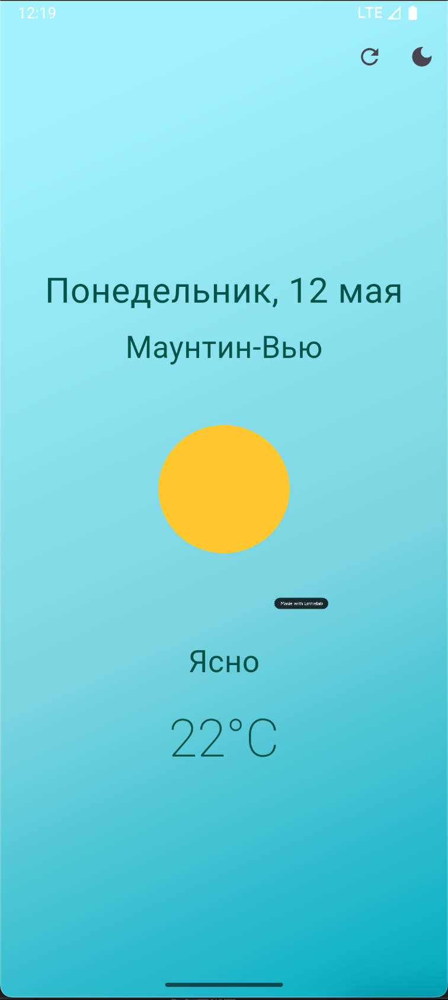
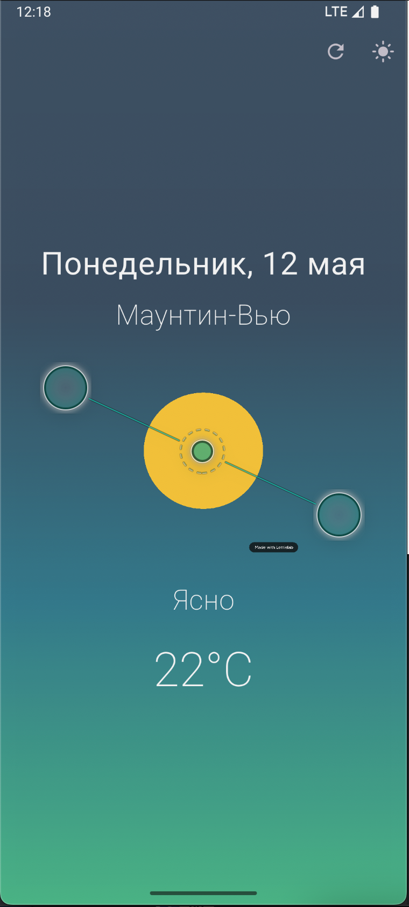

# 🌦️ Simple Weather App 

Минималистичное приложение погоды, созданное на Flutter.

[](https://flutter.dev)
[](LICENSE)

## ✨ Особенности

- 📍 Автоматическое определение местоположения через GPS
- 🌡️ Точные погодные данные
- 🌙 светлая/темная тема
- 🌍 Поддержка нескольких языков (русский/английский)
- 🔄 Обновление данных по запросу

## 📦 Установка

1. Убедитесь, что у вас установлен Flutter (версия 3.7+)
```bash
flutter --version
```

2. Клонируйте репозиторий
```bash
git clone https://github.com/Ocengrave/simple_weather_app.git
```

3. Установите зависимости
```bash
cd weather
flutter pub get
```

4. Создайте файл `.env` в корне проекта с вашим API-ключом:
```ini
WEATHER_API_KEY=ваш_ключ_от_api
```

5. Запустите приложение
```bash
flutter run
```

## 🛠 Технологии

- **Flutter** - кросс-платформенный фреймворк
- **Geolocator** - определение местоположения
- **Dio** - HTTP-запросы к погодному API
- **Lottie** - анимации погодных условий
- **Provider** - управление состоянием
- **Easy Localization** - интернационализация

> ℹ️ Приложение использует [OpenWeatherMap API](https://openweathermap.org/) для получения данных о погоде

## 🎨 Скриншоты IOS

| Светлая тема | Темная тема |
|-------------|------------|
|  |  |

## 🎨 Скриншоты Android

| Светлая тема | Темная тема |
|-------------|------------|
|  |  |


**Автор**: [Alexey Lyovin](https://github.com/Ocengrave)